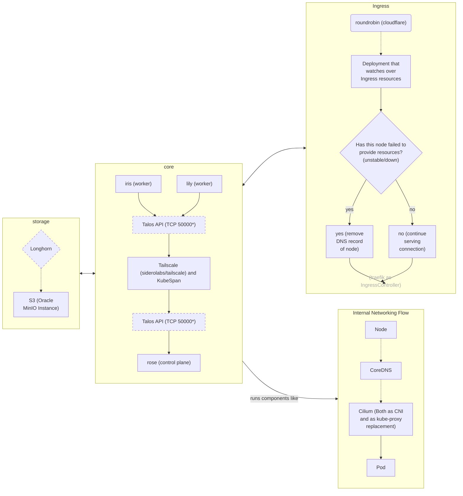

## bouquet2
Sequel to [bouquet](https://github.com/kreatoo/bouquet) that uses Talos Linux instead of k0s.


## DRAWBACKS/TODO
* When `tofu destroy` is run, it won't destroy the Tailscale entries. This is because the entry is not made by OpenTofu itself, but comes from the node. [See this issue](https://github.com/tailscale/terraform-provider-tailscale/issues/68) for more information.
* CI is not finished yet.
  * OpenTofu workflow does not have plan and apply yet.
  * K8s manifest deployment is missing entirely.
* MinIO is not yet set up (on my end).

## Setup

### Prerequisites
* [OpenTofu](https://opentofu.org)
* [Kubectl](https://kubernetes.io/docs/tasks/tools/)
* [talosctl](https://www.talos.dev/v1.9/introduction/quickstart/#talosctl)
* [just](https://github.com/casey/just)
* [Packer](https://www.packer.io/)

#### Installation
```bash
### Generating the image (Hetzner Cloud)
cd packer
cp secrets.hcl.example secrets.hcl

# Edit secrets.hcl and add your secrets
vim secrets.hcl

# Build the image
cd ..
just hcloud-image-build

### Deploying the cluster
cd tofu
mv secrets.tfvars.example secrets.tfvars

# Edit secrets.tfvars and add your secrets
vim secrets.tfvars

# Configure nodes (make sure to replace the Image IDs and URLs with the correct ones)
vim nodes.tfvars

cd ..

just deploy

### Deploying Kubernetes manifests
just deploy-manifests

### Destroying the cluster
just destroy
```


### Servers

* iris
    * Cloud: Hetzner Cloud 
    * Region: Nuremberg
    * OS: Talos Linux
    * Role: Agent node
    * Machine: CAX21 (Ampere Altra) with 4 cores, 8GB RAM, 80GB storage

* rose
    * Cloud: Hetzner Cloud
    * Region: Helsinki
    * OS: Talos Linux
    * Role: Control plane node
    * Machine: CAX21 (Ampere Altra) with 4 cores, 8GB RAM, 80GB storage
 
* lily
    * Cloud: Hetzner Cloud
    * Region: Falkenstein
    * OS: Talos Linux
    * Role: Agent node
    * Machine: CAX21 (Ampere Altra) with 4 cores, 8GB RAM, 80GB storage

### System Architecture Overview

