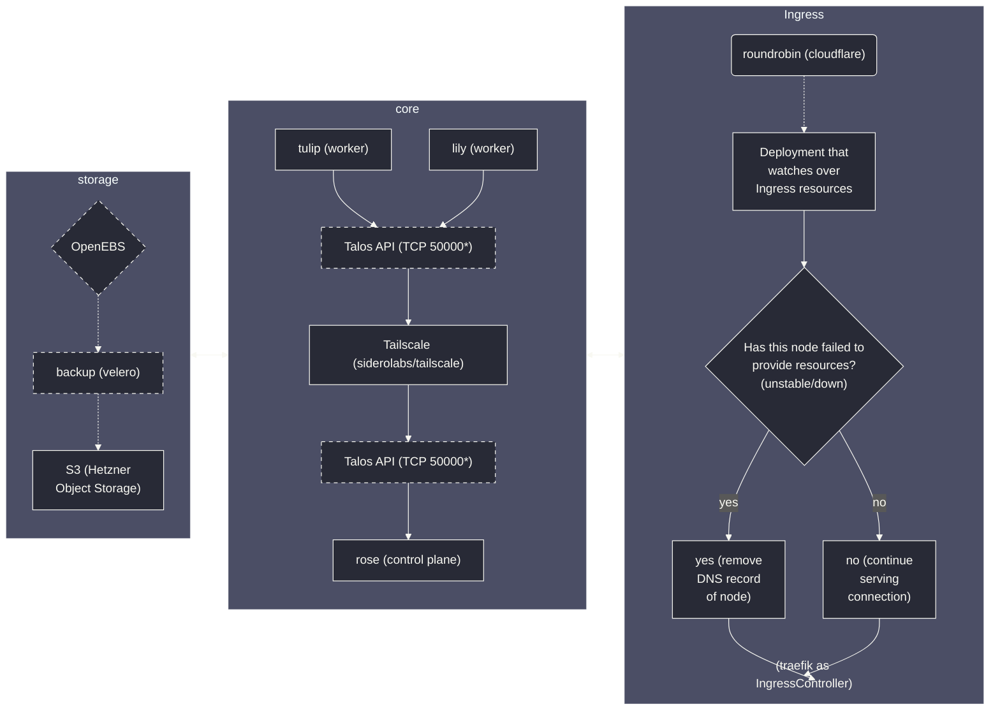

## bouquet2: Talos boogaloo
Sequel to [bouquet](https://github.com/kreatoo/bouquet) that uses Talos Linux instead of k0s.

> [!WARNING]
> This is a work in progress and is not deployed yet.

## Setup

### Servers

* tulip
    * Cloud: OCI (Oracle Cloud Infrastructure)
    * Region: Frankfurt
    * OS: Talos Linux
    * Role: Agent node
    * Machine: VM.Standard.A1.Flex (Ampere Altra) with 4 cores, 24GB RAM, 200GB storage

* rose
    * Cloud: Hetzner Cloud
    * Region: Helsinki
    * OS: Talos Linux
    * Role: Control plane node
    * Machine: CAX11 (Ampere Altra) with 2 cores, 4GB RAM, 40GB storage
 
* lily
    * Cloud: Hetzner Cloud
    * Region: Falkenstein
    * OS: Talos Linux
    * Role: Agent node
    * Machine: CAX21 (Ampere Altra) with 4 cores, 8GB RAM, 80GB storage

### System Architecture Overview

