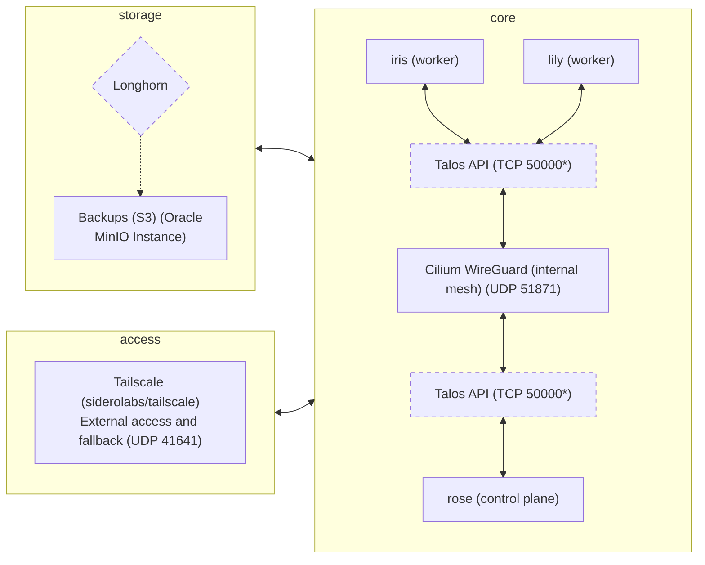

## bouquet2


Infinitely scalable, multi-cloud, secure and network-agnostic declarative Kubernetes configuration that focuses on stability and simplicity, while not compromising on modularity.

Sequel to [bouquet](https://github.com/kreatoo/bouquet) that uses Talos Linux instead of k0s, OpenTofu for provisioning resources and many more improvements.

## DRAWBACKS/TODO
* When `tofu destroy` is run, it won't destroy the Tailscale entries. This is because the entry is not made by OpenTofu itself, but comes from the node. [See this issue](https://github.com/tailscale/terraform-provider-tailscale/issues/68) for more information.

## Setup

### Prerequisites
* [OpenTofu](https://opentofu.org)
* [kubectl](https://kubernetes.io/docs/tasks/tools/)
* [talosctl](https://www.talos.dev/v1.9/introduction/quickstart/#talosctl)
* [just](https://github.com/casey/just)
* [Packer](https://www.packer.io/)

#### Installation
```bash
### Generating the image (Hetzner Cloud)
cd packer
cp secrets.hcl.example secrets.hcl

# Edit secrets.hcl and add your secrets
vim secrets.hcl

# Build the image
cd ..
just hcloud-image-build

### Deploying the cluster
cd tofu
mv secrets.tfvars.example secrets.tfvars

# Edit secrets.tfvars and add your secrets
vim secrets.tfvars

# Configure nodes (make sure to replace the Image IDs and URLs with the correct ones)
vim nodes.tfvars

cd ..

just deploy

### Deploying Kubernetes manifests
just deploy-manifests

### Do this after Cilium is up
just delete-ciliumjob

### Destroying the cluster
just destroy
```

### Kubernetes Manifests

The Kubernetes manifests are organized in the `manifests/` directory and contain all the infrastructure components and applications. For detailed information about those, please refer to the [manifests documentation](manifests/README.md).

### Servers

* iris
    * Cloud: Hetzner Cloud 
    * Region: Nuremberg
    * OS: Talos Linux
    * Role: Agent node
    * Machine: CAX21 (Ampere Altra) with 4 cores, 8GB RAM, 80GB storage

* rose
    * Cloud: Hetzner Cloud
    * Region: Helsinki
    * OS: Talos Linux
    * Role: Control plane node
    * Machine: CAX21 (Ampere Altra) with 4 cores, 8GB RAM, 80GB storage
 
* lily
    * Cloud: Hetzner Cloud
    * Region: Falkenstein
    * OS: Talos Linux
    * Role: Agent node
    * Machine: CAX21 (Ampere Altra) with 4 cores, 8GB RAM, 80GB storage

### System Architecture Overview

